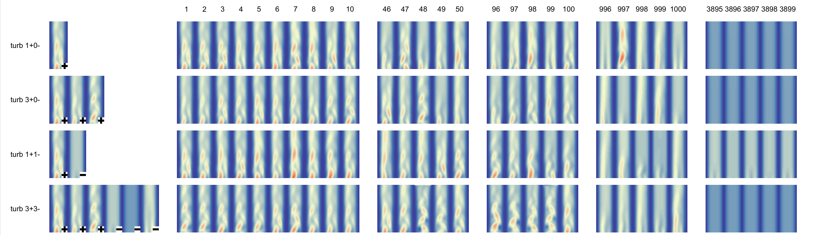
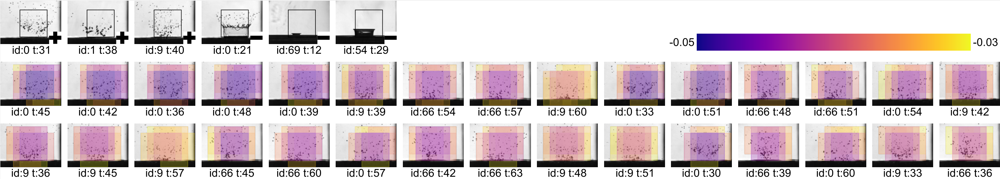

# S4: Self-Supervised learning of Spatiotemporal Similarity
Code for the ["S4: Self-Supervised learning of Spatiotemporal Similarity"](https://ieeexplore.ieee.org/document/9503317) paper.

[Replicability Stamp](http://www.replicabilitystamp.org/#https-github-com-gleb-t-s4)

## Prerequisites

To run it, you will need:
- Any modern Linux distribution. Tested on CentOS 7.0
- Git and Git LFS.
- Singularity
  - An HPC-focused containerization tool.
  - Available as a [package](https://singularity.hpcng.org/admin-docs/master/installation.html#distribution-packages-of-singularity) or can be built from [source](https://github.com/hpcng/singularity).
  - You will need *root* to build the S4 container image (see below).
- NVIDIA drivers.
  - The code uses Tensorflow and CUDA, so an NVIDIA GPU is needed.
  - The driver cannot be containerized with Singularity, so it should be installed on the host. 
  - [Instructions from NVIDIA](https://docs.nvidia.com/datacenter/tesla/tesla-installation-notes/index.html)

Everything else is installed automatically inside the container.

## Build and Run

The steps described below, including building and running the code, can be done with the `build-and-reproduce.sh` script:
- `cd S4`
- `chmod u+x build-and-reproduce.sh && ./build-and-reproduce.sh`

If you run into problems, follow the detailed instructions:
1. First, check that everything is in place.
    - Test Singularity `singularity --debug run library://sylabsed/examples/lolcow`. 
    - And check that the GPU is accessible `nvidia-smi`. This should show info about the GPU.
2. Next, clone the repo `git clone https://github.com/gleb-t/S4.git`
   - Change to the dir: `cd S4`.
   - Make sure that the Git LFS files are pulled: `git lfs pull`.
   - If Git LFS isn't installed, install it. There's probably a `git-lfs` package for your distro, e.g. `yum install git-lfs`.
3. Unpack the data files
   - The ensemble data: `(cd data; unzip -o cylinder-ensemble.zip)`.
   - And the pre-computed raw results: `(cd out; unzip -o 20200817-153710_cluster-1125_200817_cylinder-300-2-basic_all-metrics.zip)`.
4. Now, you need to build the SIF image (container). Unfortunately, this requires root:
`sudo singularity build -F s4-image.sif Singularity/s4-image.def`.
5. Finally, you can run the script that reproduces Figure 7 and Table 2 from the paper:
    - `./reproduce-figures.sh`
      - This will generate the figure/table in `out/paper` using the precomputed raw results.
    - `./reproduce-figures.sh --recompute`
      - Same, but will first recompute the query matches using all the metrics.
      - Warning! This takes about **50 hours** on an average machine because of the EMD-based baselines.

## Overview

Below you'll find a brief overview of the S4 implementation and the design choices that went into it.

### The code

The central part of this repo is the 'Siamese' project/dir. 
This name is used throughout the codebase, and was left unchanged in the spirit of making as few changes as possible when publishing the code.

The 'Siamese' program is run by launching `Siamese/siamese.py`, where the bulk of the high-level logic resides.
The program reads the config file, creates output dirs, prepares loggers and other infrastructure, and finally starts the main pipeline.
The pipeline is implemented using the [PyPlant framework](https://github.com/gleb-t/pyplant) that helps to cache intermediate results during development and makes it easier to deal with out-of-core processing.
All the main pipeline elements (reactors) are located in `Siamese/siamese` so that the high-level logic of the program can be gleaned from this single file.

The 'PythonExtras' module contains an assortment of utility functions. Not all the functionality is used by the main project because it is a generic library used by many other projects.
Some functionality (patching, in particular: `patching_tools`, `MtPatchExtractor`) is backed by C++ code from the `PythonExtrasC` dir.
The C++ code is built into a shared library and accessed using `ctypes`. The build is done automatically when creating the container image, but can also be done manually via the Visual Studio solution or the Makefile.

The interactive web tool can be found in `Siamese/app`.

### The config

The configuration is stored as executable Python files in the `configs` dir. A few examples are provided. 
The config file needs to contain a `configure(config: SiameseConfig)` function that receives and modifies the config object.
This approach is convenient, avoids string parsing and enables IDE support when writing configurations or refactoring.
Furthermore, we can directly configure the ML models by writing `keras` code, see `configs/models`.

### The container

For ease of execution across different machines and clusters, the code can be packaged into a [Singularity](https://sylabs.io/singularity/) container.
The definition file is provided in `Singularity/s4-image.def`, see [Build-and-Run](#Build-and-Run) for build instructions.
Most of the dependencies (as many as possible) are installed using Conda and the environment file `environemtn.yml` into the Singularity image.
This is done for the convenience of using the package manager, but also allows to run the code without Singularity during development.
You can create the environment with `conda env create --name siamese --file /app/src/environment.yml` if you prefer this method.

### Runsets and runs

Every execution of the Siamese code loads the data, prepares it, trains the model, computes matches, 
computes metrics and stores the results into the output dir.
This is called a *run*, a single execution for a given configuration.

Typically, the runs are not performed on their own, but are grouped into *runsets*.
A runset is a collection of runs either with identical configuration (for uncertainty estimation) 
or with varied configs for parameter studies.
The outputs are usually saved as `runset-id/run-id/<run outputs>`. 
The runset IDs are generated from the current timestamp, job id and the config name.
The run IDs contain a timestamp, a random name and the config name.
For example, bundled with this code is the runset `20200817-153710_cluster-1125_200817_cylinder-300-2-basic_all-metrics` 
with a single run `200817-153723-crimson-pond_200817_cylinder-300-2-basic_all-metrics`.

Once the runs are computed the results are processed and rendered using scripts found in `Siamese/scripts`.

